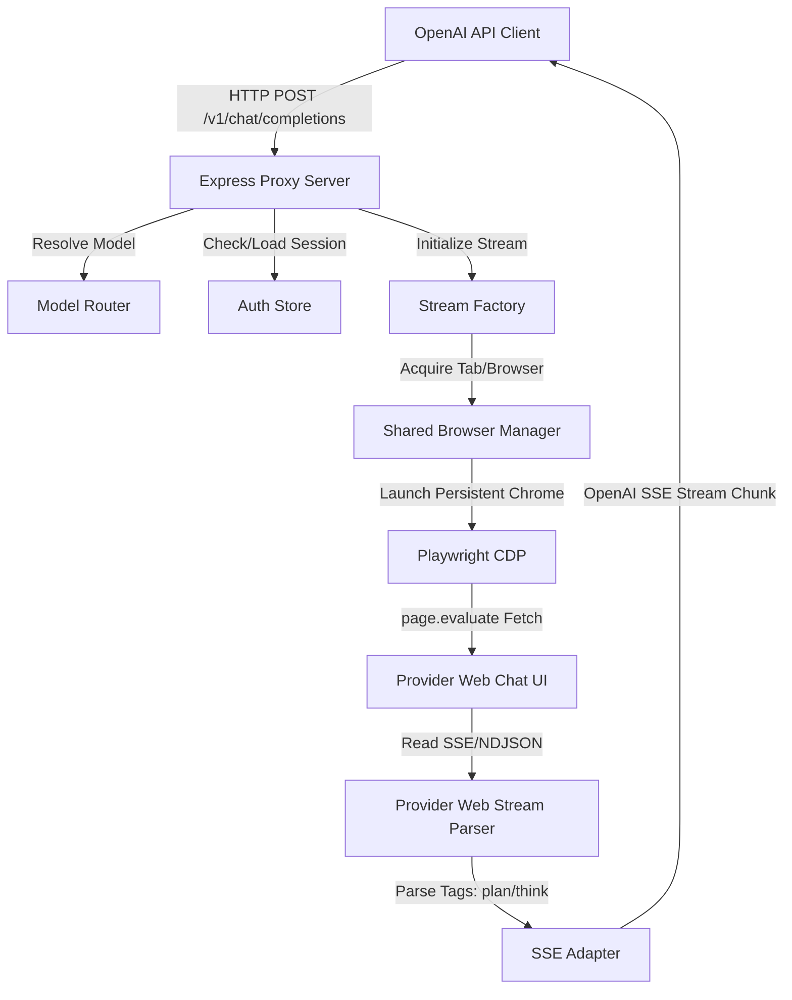

# System Architecture — Zero-Token Standalone LLM Proxy

This document provides a detailed breakdown of the system architecture, code modules, and security bypass strategies used in the Zero-Token standalone proxy.

---

## High-Level Architecture Overview

The Zero-Token proxy acts as an intermediary bridge between standard OpenAI client interfaces (like LibreChat or curl) and the internal web APIs of consumer LLM chat platforms (like chat.deepseek.com or chat.sakana.ai). 

---

## Structural Components & Modules

The application is structured into modular components, separating network handling, model mapping, browser orchestration, and parsing.

### 1. REST API Interface (`src/server.ts`)
Exposes an Express-based server mimicking standard OpenAI endpoints:
- **`GET /v1/models`**: Queries active credentials in `auth.json` and dynamically lists only the models that are currently authenticated.
- **`POST /v1/chat/completions`**: Parses the incoming payload, maps system prompt configuration, executes completions via the provider streams, and pipes responses. Handles both streaming (`stream: true`) and non-streaming responses.

### 2. Model Router & Provider Registry (`src/model-router.ts`)
Dynamically resolves target models to their matching provider instances:
- Maps friendly names (e.g., `namazu-thinking`) to target provider IDs (e.g., `sakana-web`).
- Supports explicit routing flags via namespaces (e.g., `<providerId>/<modelId>`).

### 3. Authentication Store (`src/auth-store.ts`)
Manages reads and writes to the local JSON file `./auth.json`:
- Saves captured session cookies, CSRF tokens, device IDs, and User-Agents during onboarding.
- Provides thread-safe loading of credentials.

### 4. Shared Browser Manager (`src/zero-token/providers/shared-browser.ts`)
Manages Chrome browser lifetimes to conserve local memory and CPU resources:
- **Ref Counting**: Implements reference counting (`sharedRefCount`). Launches Chrome when the first provider requests it, and automatically closes it when all active streams release their handles.
- **Stealth Injection**: Injects a custom JavaScript stealth block into every page initialization to spoof runtime APIs, bypass bot detection, and hide Playwright automation markers.
- **Hidden Windowing**: Positions Chrome off-screen (`--window-position=-32000,-32000`) and scales the window size to `1x1` to run in a hidden headful mode.

### 5. Web Provider Clients (`src/zero-token/providers/*-web-client-browser.ts`)
Executes the target API interaction inside the context of the opened page (`page.evaluate`):
- Inject session cookies into the browser context.
- Start or join active chat threads (e.g., `POST /conversation` on Sakana).
- Send prompt payload via `fetch` operations running *within the browser context*. This ensures that headers like `Origin`, `Referer`, and TLS signatures exactly match a legitimate user interaction.

### 6. Streaming Adapter & Parser (`src/sse-adapter.ts` & `src/zero-token/streams/`)
Transforms web-chat payloads to standard OpenAI completions format:
- **NDJSON Stream Reader**: Reads JSON-lines emitted by SvelteKit or generic event-streams.
- **Tag State Machine**: Implements XML-like tag parsing to separate reasoning text (`<plan>` or `<think>`) from output content (`<answer>`).
- **SSE Writer**: Formats SSE chunks as `data: {"choices": [{"delta": {"content": "..."}}]}`.

---

## Anti-Detection & Bot Bypass Techniques

Consumer web chat platforms use advanced security services (like Cloudflare Turnstile or Akamai) that block typical HTTP libraries (Axios, Fetch, etc.) based on fingerprinting. Zero-Token bypasses these challenges using four techniques:

### 1. In-Page Fetching (Bypassing TLS & JA3 Fingerprinting)
Web scraping libraries emit distinct TLS signatures (JA3/JA4 fingerprints) that firewalls immediately reject. Zero-Token navigates a real Chrome browser instance to the target platform and executes the API requests inside the page context using `page.evaluate()`. The firewall sees a standard, legitimate Google Chrome TLS handshake.

### 2. User-Agent & Cookie Alignment
Web firewalls check if incoming request headers match the browser connection profile. Zero-Token reads the browser's native `navigator.userAgent` at login and saves it, ensuring that all headers generated during API fetches align exactly with the browser session configuration.

### 3. Spoofing Chrome Runtime & Automation Markers
To prevent Cloudflare from detecting that the browser is driven by Playwright, the shared browser manager disables the `--enable-automation` flag and injects a script to:
- Override `navigator.webdriver` to return `false`.
- Spoof `window.chrome.runtime` APIs to match a standard consumer installation.
- Provide mock language arrays (`languages: ['zh-CN', 'en-US']`) and PDF reader plugin configurations.
- Scrub automation markers from error stack traces.

### 4. Persistent User Profile Directories
Using `launchPersistentContext` bind-mounts a unified user directory (`~/.openclaw/browser/api-chrome`). This stores browser storage, session cookies, and index databases directly on disk. Firewalls recognize the persistent browser state and avoid triggering Turnstile challenges on subsequent requests.
