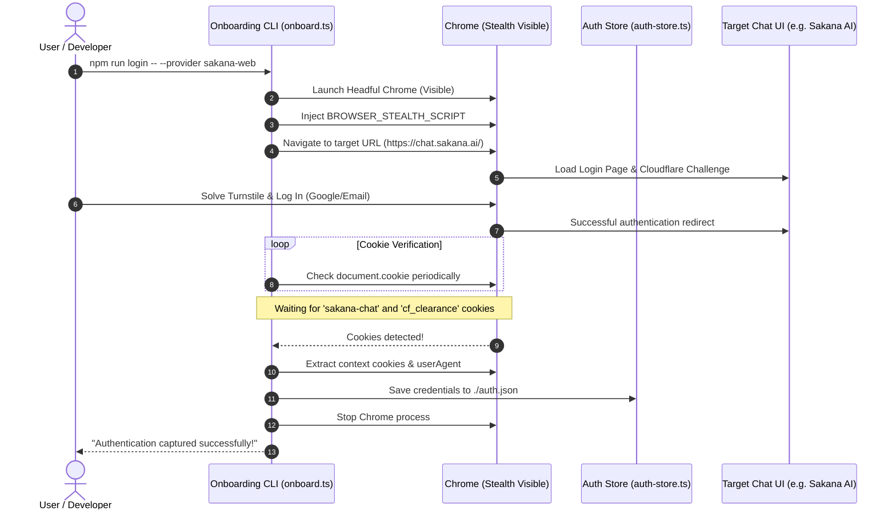
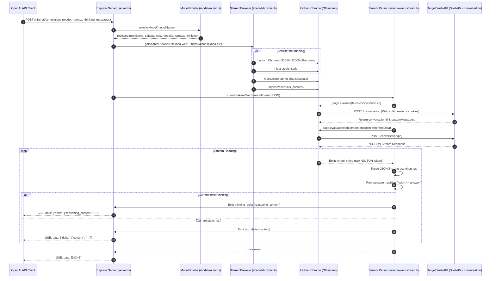

# System Flows — Zero-Token Standalone LLM Proxy

This document details the operational flows within the Zero-Token proxy, including the interactive CLI onboarding sequence and the completions request lifecycle.

---

## 1. Onboarding & Login Flow

The onboarding flow runs via `npm run login` to authenticate the web providers. It launches a visible browser instance to let users log in manually, bypass Turnstile checks, and automatically captures the resulting cookies.

---

## 2. API Request & Completions Flow

When an external OpenAI client makes a request to `/v1/chat/completions`, the proxy coordinates the shared browser instance and streams standard OpenAI SSE responses in real-time.

---

## Technical Details

1. **Off-Screen Windowing**:
   Chrome is started with args `--window-position=-32000,-32000 --window-size=1,1`. Since it is positioned well outside the display buffer coordinates, it is invisible to the developer, while operating fully as a headful browser (which helps pass anti-bot scripts that block headless runtimes).
2. **Page Re-use**:
   The shared browser checks `sharedContext.pages()` first. If a tab already exists for `chat.sakana.ai`, it reuses it instead of opening a new one, avoiding the overhead of navigating and compiling scripts repeatedly.
3. **Graceful Error Recovery**:
   If the browser crashes or is terminated by the OS, the proxy intercepts the failure (`Target page, context or browser has been closed`), destroys the dead context reference, and triggers a retry that spins up a fresh Chrome instance transparently.
